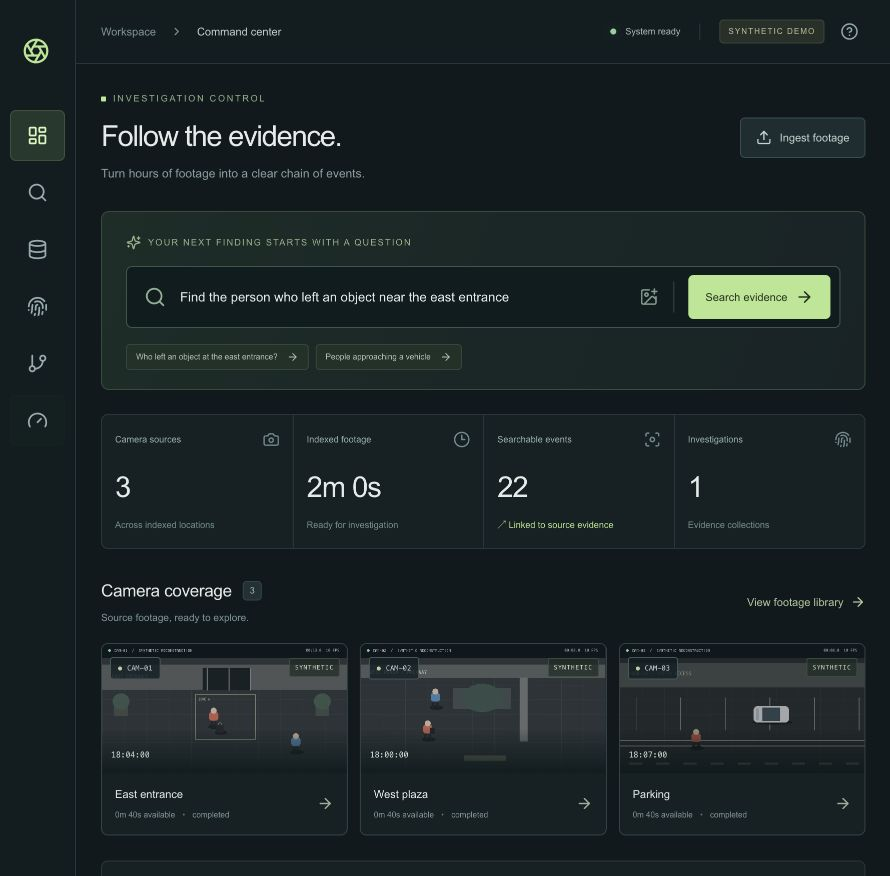

# VIGILIA

Evidence-grounded video investigation prototype. [GitHub repository](https://github.com/vivekwork125-rgb/Vigilia).



## Problem

Reviewing long recordings across cameras takes time. A search hit is useful only if an investigator can inspect the exact source frames and distinguish visible facts from behavioral hypotheses.

## Solution

VIGILIA ingests source video, records its hash and camera time, samples frames, detects and tracks entities, extracts conservative temporal events, and indexes source-linked evidence. Investigators can search, open the video at an event, inspect its timeline and relationships, collect findings, and export an evidence-backed report. Retrieval scores are ranking signals, not identity probabilities.

## Architecture and technology stack

Next.js 16/React/TypeScript provides the workspace and same-origin API proxy. FastAPI, SQLAlchemy, OpenCV, and scikit-learn implement ingestion, processing, evidence, and retrieval. SQLite is the verified local database. A PostgreSQL/pgvector Compose configuration exists but could not be run on the current host. The local CPU baseline is OpenCV HOG for people; YOLO11n + ByteTrack is an optional model adapter with a limited integration smoke test. See [architecture](docs/ARCHITECTURE.md).

## Features verified in this repository

- Bounded video upload, metadata validation, source SHA-256, durable single-worker indexing, progress and error reporting.
- Track records, timestamped boxes, HSV crop embeddings, and video/frame-linked evidence.
- Track-derived zone changes, motion transitions, approach/departure, placement, pickup, and configurable unattended-object **hypotheses**. The latter three require multi-frame object tracks and must be reviewed against footage; they have been exercised on encoded synthetic video, not independently validated on field footage.
- Deterministic entity/event/attribute/camera/time filters, TF-IDF ranking, interval joins, transparent signal weights, negative-result coverage, and coarse reference-image search.
- Source video seek, bounding box overlay, entity timeline with filters and time zoom, stored evidence-backed relationship edges, and reports from collected findings.
- A 40-query authored-annotation **development fixture**, plus tooling for independent manual labels and paired human timing studies. Neither real-world retrieval accuracy nor time savings has been measured.

## Setup

Requirements: Python 3.12/3.13, Node 20.9+, npm. From the repository root:

```bash
./scripts/dev.sh
```

Open [localhost:3100](http://localhost:3100/). The API is at [localhost:8100](http://localhost:8100/docs). Generated media, uploads, and SQLite data stay in ignored `data/`. For manual setup, install `backend/requirements.txt` into `.venv`, run `PYTHONPATH=backend .venv/bin/python -m uvicorn app.main:app --host 127.0.0.1 --port 8100`, then `cd frontend && npm ci && npm run dev` in another terminal. Copy `.env.example` to `.env` before customizing backend, tokens, sampling, and the unattended interval. Run one API worker only.

For YOLO, install `backend/requirements-models.txt` and set `PERCEPTION_BACKEND=yolo`. HOG remains a people-only CPU fallback. Optional OpenCLIP and EasyOCR require their dependencies and models; they were not verified here. `DEMO_MODE=false` requires a shared API token of at least 24 characters. This prototype has no per-user roles or production privacy controls.

## Demo

Startup includes the original three-camera **authored annotation** fixture for UI and parser regression. It also creates a separate 30-second synthetic MP4 and indexes its decoded pixels with a fixture-specific color-contour detector through the ordinary track/event/evidence pipeline. That second fixture produces placement, unattended, and pickup hypotheses without injecting event labels. Its detector only recognizes the generated colored shapes; it is not a surveillance model. The two fixture types are labeled separately in the evidence viewer. See [demo guide](docs/DEMO.md).

## Evaluation

```bash
.venv/bin/pytest -q
cd frontend && npm run typecheck && npm run build
```

The 40-query lab measures retrieval against authored events only. For a defensible study, annotate at least 30–50 queries from independently reviewed footage with `scripts/evaluate_independent.py`, then record manual and assisted timings with `scripts/timing_study.py`. The independent evaluator refuses fewer than 30 queries unless explicitly run as a small smoke fixture. [Evaluation protocol](docs/EVALUATION.md) explains the labels, metrics, and study controls.

## Limitations and known unverified components

Field-footage placement/pickup/unattended performance, vehicle entry/exit, continuous identity across cameras, OpenCLIP text-image retrieval, OCR, PostgreSQL/Docker execution, and measured investigation-time reduction remain unverified or incomplete. The current host has no Docker daemon, OpenCLIP, or EasyOCR installed. No reported synthetic metric should be used as a real-world accuracy claim. See [limitations](docs/LIMITATIONS.md), [initial audit](docs/IMPLEMENTATION_AUDIT.md), and [final verification](docs/FINAL_VERIFICATION.md).
