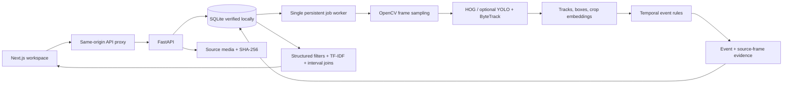

# Architecture

`backend/app/main.py` owns upload, indexing, search, evidence, graph, reports, evaluation, and access-control routes. `db.py` defines locations, cameras, videos, entities, tracks, observations, embeddings, evidence, events, event membership, relationships, investigations, findings, authored benchmark queries, and timing rows. `processing.py` decodes sampled frames, records detector tracks, stores observations and embeddings, and invokes `temporal_events.py`. The latter derives motion, zone, proximity, placement, pickup, and unattended **hypotheses** from timestamped boxes. `temporal.py` implements BEFORE, AFTER, DURING, NEAR, WITHIN, FOLLOWED_BY, and OVERLAPS interval tests. `retrieval.py` uses hard metadata constraints, TF-IDF or optional OpenCLIP cosine, and transparent configured signal weights. These weights are prototype heuristics, not calibrated probabilities.

Every generated event links to `Evidence`, which links to the source video and, for track-derived events, a primary observation. The observation links to a track and sampled boxes. `/evidence/{id}` returns the frame range, timestamp range, primary track, and sampled boxes for **all participating entity tracks** inside the interval. Event category is OBSERVED for a direct detector appearance and INFERRED for geometric behavior; cross-camera candidate associations are CORRELATED hypotheses. The report is assembled from stored findings and cites evidence IDs. A source hash and derived evidence digest aid traceability but do not provide a tamper-proof chain of custody.

The local demo contains two distinct data types. Three 40-second clips have **authored event/trajectory annotations** to exercise interface and retrieval vocabulary. A separate 30-second MP4 is decoded and indexed by the ordinary worker using a fixture-specific pixel-contour adapter. Its placement, unattended, and pickup labels are emitted by the temporal rules. The color-contour adapter recognizes only generated colored shapes and is not evidence of performance on natural video. The pipeline fixture intentionally does not enter the 40-query authored-annotation benchmark.

`frontend/src/components/` contains the command workspace, ingestion/library, source evidence player and timeline, stored evidence graph, and evaluation lab. Clicking a result, timeline event, or graph relationship opens the associated source interval. The graph includes stored event/entity relationships, cameras, and locations; it does not establish identity across cameras. SQLite is the only database exercised end to end on this host. PostgreSQL/pgvector and Docker files exist but the daemon was unavailable for execution.

The worker runs in the API process and must have exactly one process. Deployment still needs leased background jobs, migrations, per-user permissions, audit logs, media isolation, quotas, and controlled retention. See [limitations](LIMITATIONS.md).
