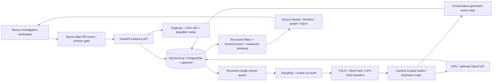

# VIGILIA technical report

## Architecture

The code, fixture, and repository are standalone. No prior project implementation is reused.

## Storage and provenance

The executable schema is `backend/app/db.py`; PostgreSQL DDL is checked into `db/schema.sql`. Foreign keys connect cameras, locations, videos, entities, tracks, observations, embeddings, evidence, events, event membership, relationships, investigations, findings, benchmarks, ground truth, evaluation runs, and review timings. Every event requires evidence and every evidence record requires a source video. An observation contains sampled frame numbers, timestamps, boxes, camera-scoped entity linkage, and coarse attributes.

Source bytes are SHA-256 hashed while uploading. The provenance digest incorporates the source hash, video ID, method, and exact frame range. APIs do not expose an update/delete operation for evidence. This is application-level append-only provenance, not a forensic chain-of-custody guarantee: an administrator can modify the underlying filesystem/database. Playback transcodes and clipped exports are derivatives; their timestamps and original hash remain tied to the source.

Metadata uses indexed foreign keys and timestamp/event-type indexes. Embedding vectors are stored in native pgvector columns on PostgreSQL and JSON on SQLite. Retrieval currently computes exact cosine over the filtered prototype candidate set. There is no approximate-nearest-neighbor index or claimed million-video scalability.

## Ingestion and processing

Uploads stream in bounded chunks, validate extension, codec, dimensions, time zone, duration, and the ability to decode a frame. Originals retain generated names to prevent path traversal. An explicit index request changes the video row to `queued`. One background worker polls persisted jobs; interrupted processing jobs are recovered on startup. Per-video evidence insertion is transactional, so a failed job cannot leave partially searchable results. Completed requests are idempotent; only failed/unindexed items can be retried.

Run exactly one API worker. This queue is designed for a hackathon workstation, not distributed execution. A production deployment should separate workers, add leased job claims and cancellation, enforce resource quotas, and schedule GPU memory use.

Frames are sampled at configurable FPS. Large scene changes reset the tracker. Keyframe selection keeps the largest visible crop per track rather than embedding every frame. YOLO uses ByteTrack with persistent IDs within that video/scene. The dependency-free perception fallback is OpenCV HOG + IoU, with substantially weaker people-only coverage. Neither tracker establishes identity across cameras.

Rules create observed first detections and inferred disappearance/stationary behavior. Zone events use a configured normalized rectangle and a bounding-box footpoint. Person/vehicle approaches require a measured decrease in normalized distance during overlapping frames and remain inferred. Arbitrary real-footage placement, pickup, entering a vehicle, following, and unattended-object ownership are not robustly implemented; those demo events are authored fixture annotations. The system deliberately does not interpret proximity as confirmed contact.

## Retrieval

The deterministic parser recognizes object class, color, known location, numbered camera, event vocabulary, clock windows, duration, and before/after windows. It exposes the parsed plan and warnings. Hard constraints remove nonmatching candidates before ranking. Default semantic scoring is TF-IDF over normalized evidence descriptions; this is a lexical baseline with a small synonym vocabulary, not broad language understanding. Optional OpenCLIP uses image/text cosine for crops indexed with that model.

The configurable default weights are semantic .35, attributes .20, temporal .15, spatial .10, event .15, graph .05. Only applicable signals enter the weighted average. Hard-filter signals are Boolean matches; cosine is the measured embedding/TF-IDF similarity. Null means not evaluated. A displayed 100% attribute match does not mean 100% identity confidence. Detection scores, relevance scores, and certainty labels are distinct.

Temporal queries join compatible source intervals, requiring shared entities when the target is not explicitly selected. Relative context supports before/after the selected event. Clock filters use each source's timezone. A selected recording date is not yet a natural-language constraint; explicit camera and source context should be used for multi-day datasets.

Reference-image retrieval uses 48-bin HSV cosine. It is intentionally labeled a coarse appearance baseline and is sensitive to cropping/backgrounds. Cross-camera association combines the same appearance measurement, color agreement, configured travel intervals, and camera connectivity. Multiple close candidates return ambiguous status; missing camera connectivity rejects a link. No association is promoted into an identity or continuous trajectory.

Negative searches report known recording intervals, indexing availability, candidate count, and unknown camera operational status. Interval coverage is computed per camera and recording date without bridging gaps. The system never equates no retrieval result with proof of absence.

## Evaluation

Forty checked-in query/ground-truth pairs exercise the controlled three-camera fixture, including negative queries and difficult conditions. The endpoint computes Precision@1, Precision@5, Recall@5, MRR, mAP@5, negative-query false-positive rate, and measured latency. Synthetic queries are scoped to synthetic videos, so unrelated uploads do not contaminate the benchmark.

These queries test the implemented vocabulary on authored annotations. They are a development fixture, not a held-out generalization study. Perfect top-one performance on this fixture says nothing about real-world YOLO accuracy, complex behavior understanding, or cross-camera identity. P@5 has a fixed denominator of five even when the relevant set is smaller. Temporal IoU, start/end error, and association accuracy remain null until independent predictions and ground truth exist. The app only calculates investigation-time reduction when paired timings for the same task have been recorded; none are invented.

`docs/benchmark-results.json` is an actual generated run with every query's expected and retrieved IDs. Regenerate it with `python scripts/benchmark.py`. Report dataset version, source hashes, parser version, model settings, and environment with any benchmark claim.

## Security, privacy, and limits

Local demo mode is unauthenticated and binds to loopback. For non-demo mode, FastAPI requires a token of at least 24 characters. Configure the same token for the frontend; the browser unlock route sets an HttpOnly, SameSite=Strict session cookie. The proxy checks that session and forwards the server-held token to FastAPI. Direct media, clips, images, and API routes are protected by the same backend dependency. Use HTTPS with production secure cookies. This is a single shared investigator credential, not enterprise RBAC or multi-tenant isolation.

There is no facial identification, demographic classifier, criminality inference, or personal identity database. Synthetic demo media contains no real people. Use consented footage and minimize retention. Production work still requires per-user access control, audit logging, retention/deletion workflows, rate limiting, isolated media decoders, malware scanning, reverse-proxy request limits, backups, migrations, database roles, and independent evaluation. Do not expose the local demo to a public network as a finished security product.
